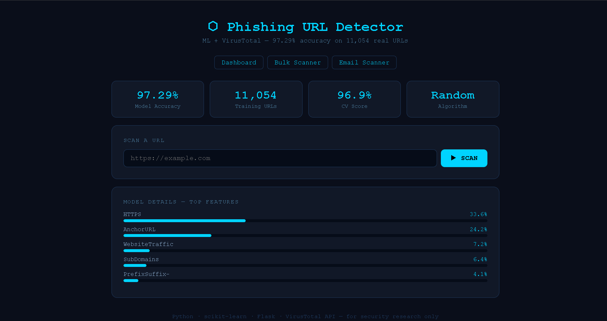
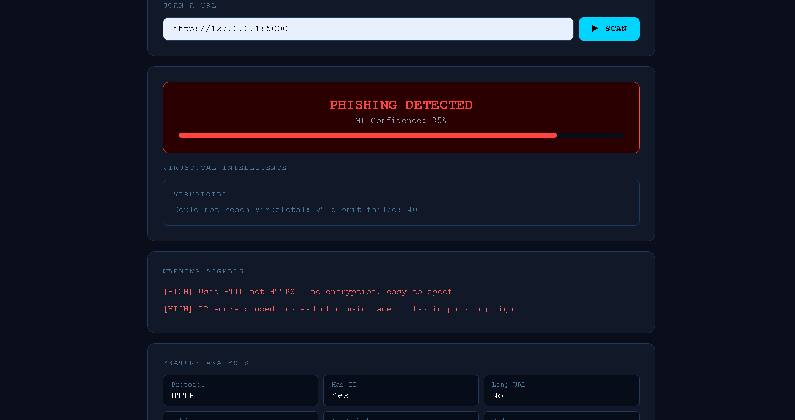
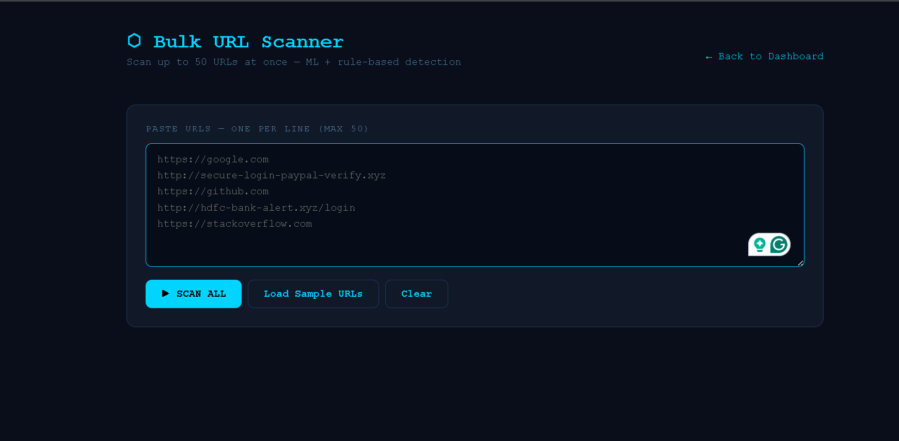
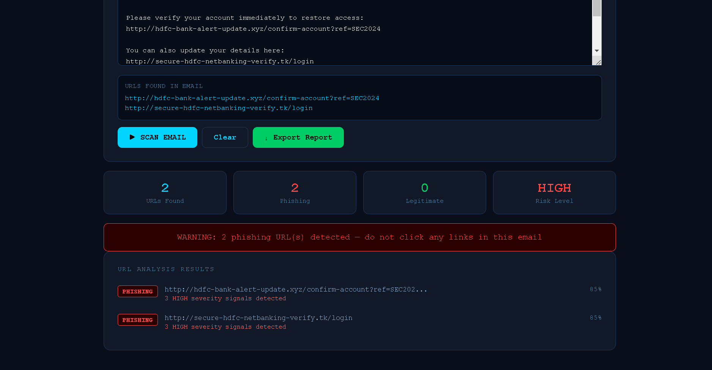
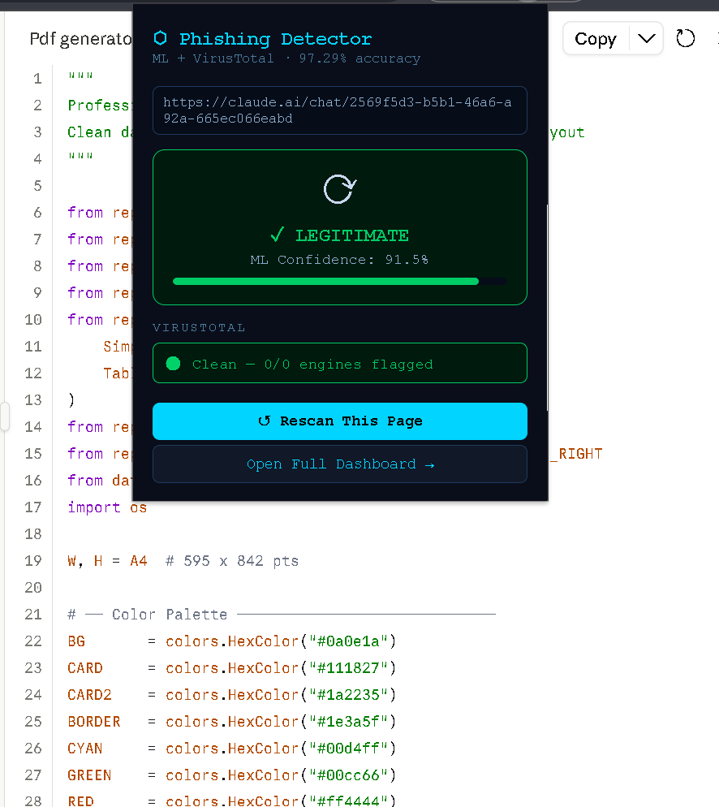
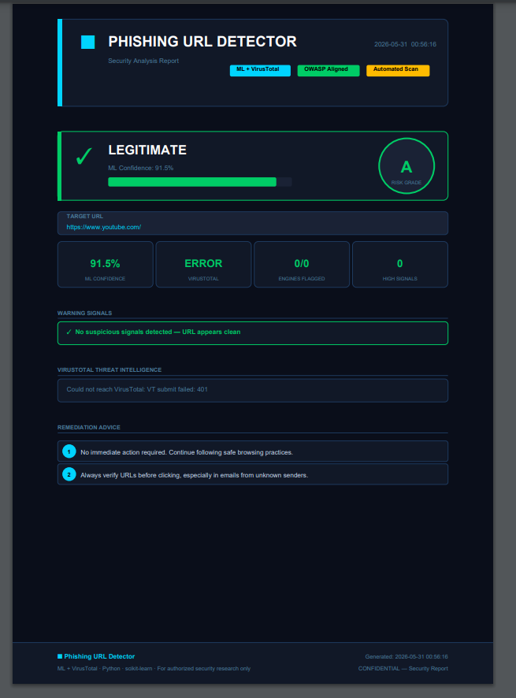

# ⬡ Phishing URL Detector

> ML-powered phishing detection with VirusTotal integration, Chrome extension, bulk scanning, email analysis, and Docker support.


---

## What It Does

A full-stack cybersecurity tool that detects phishing URLs using a hybrid approach — machine learning trained on 11,054 real-world URLs combined with rule-based signal detection and live VirusTotal threat intelligence.

**97.29% accuracy. 96.9% cross-validation score.**

---

## Features

| Feature | Description |
|---|---|
| ML Detection | Random Forest trained on UCI Phishing Dataset (11,054 URLs) |
| VirusTotal API | Cross-checks every URL against 70+ antivirus engines |
| Rule-based Override | 15 hand-crafted URL signals with severity scoring |
| Chrome Extension | Real-time tab scanning with badge + desktop notifications |
| Bulk Scanner | Scan up to 50 URLs at once with CSV export |
| Email Scanner | Paste any email — extracts and scans all URLs automatically |
| PDF Reports | Professional security report generation |
| Docker | One-command deployment |

---

## Tech Stack

- **Backend** — Python, Flask
- **ML** — scikit-learn (RandomForestClassifier, GradientBoostingClassifier)
- **Feature Extraction** — tldextract, urllib, Shannon entropy
- **Threat Intel** — VirusTotal API v3
- **Reports** — ReportLab
- **Frontend** — Vanilla JS, CSS (no frameworks)
- **Extension** — Chrome Manifest V3
- **DevOps** — Docker, Docker Compose

---

## Project Structure

```
phishing-detector/
├── app.py                      # Flask web app + API routes
├── requirements.txt
├── Dockerfile
├── docker-compose.yml
├── src/
│   └── feature_extractor.py    # 15 URL feature extraction
├── data/
│   ├── phishing.csv            # UCI dataset (11,054 URLs)
│   └── dataset_generator.py
├── models/
│   ├── train_model.py          # Model training + evaluation
│   ├── phishing_model.pkl      # Trained model
│   └── metadata.json           # Accuracy, CV scores, features
├── templates/
│   ├── bulk.html               # Bulk URL scanner
│   └── email_scanner.html      # Email URL extractor
├── static/
│   └── main.js                 # Frontend JavaScript
├── reports/
│   └── pdf_generator.py        # PDF report generation
└── extension/                  # Chrome extension
    ├── manifest.json
    ├── background.js
    ├── popup.html
    └── popup.js
```

---

## Vulnerabilities Detected

The rule-based engine flags these signals in real time:

| Signal | Severity |
|---|---|
| HTTP instead of HTTPS | HIGH |
| IP address as domain | HIGH |
| Suspicious TLD (.xyz, .tk, .ml) | HIGH |
| 3+ phishing keywords in URL | HIGH |
| Known brand spoofing | HIGH |
| @ symbol in URL | HIGH |
| 3+ subdomains | WARN |
| 2+ hyphens in domain | WARN |
| High domain entropy | WARN |
| Double slash in path | WARN |

---

## Quick Start

### Option 1 — Docker (Recommended)

```bash
git clone https://github.com/yourusername/phishing-detector
cd phishing-detector
docker-compose up --build
```

Visit `http://localhost:5000`

### Option 2 — Local Setup

```bash
git clone https://github.com/yourusername/phishing-detector
cd phishing-detector
pip install -r requirements.txt
python models/train_model.py
python app.py
```

Visit `http://127.0.0.1:5000`

---

## Chrome Extension Setup

1. Open Chrome → `chrome://extensions/`
2. Enable **Developer Mode**
3. Click **Load unpacked**
4. Select the `extension/` folder
5. Make sure Flask server is running

The extension will automatically scan every tab and show a green/red badge.

---

## API Usage

### Scan a single URL
```bash
curl -X POST http://localhost:5000/predict \
  -H "Content-Type: application/json" \
  -d '{"url": "http://suspicious-site.xyz/login"}'
```

### Response
```json
{
  "prediction": 1,
  "confidence": 85.0,
  "flags": [
    ["HIGH", "Uses HTTP not HTTPS"],
    ["HIGH", "Suspicious TLD (.xyz)"]
  ],
  "vt": {
    "malicious": 3,
    "total": 72,
    "verdict": "MALICIOUS"
  }
}
```

### Bulk scan
```bash
curl -X POST http://localhost:5000/bulk-scan \
  -H "Content-Type: application/json" \
  -d '{"urls": ["https://google.com", "http://phish.xyz/login"]}'
```

---

## Model Performance

| Metric | Score |
|---|---|
| Accuracy | 97.29% |
| Cross-Validation (5-fold) | 96.9% |
| Training Samples | 8,843 |
| Testing Samples | 2,211 |
| Dataset | UCI Phishing Websites |

### Top Features by Importance

| Feature | Importance |
|---|---|
| HTTPS | 33.6% |
| AnchorURL | 24.2% |
| WebsiteTraffic | 7.2% |
| SubDomains | 6.4% |
| PrefixSuffix | 4.1% |

---

## Screenshots

### Dashboard


### Phishing Detected


### Bulk Scanner


### Email Scanner


### Chrome Extension


### PDF Report


---

## Environment Variables

Create a `.env` file or set directly in `app.py`:

```
VT_API_KEY=your_virustotal_api_key_here
```

Get a free API key at [virustotal.com](https://www.virustotal.com/gui/join-us) — 500 requests/day on free tier.

---

## Disclaimer

> This tool is intended for **authorized security testing and educational purposes only**. Do not use against systems you do not own or have explicit permission to test. The authors are not responsible for misuse.

---

## License

MIT License — free to use, modify, and distribute.

---

## Author

Built as a cybersecurity portfolio project demonstrating:
- Machine learning for threat detection
- REST API design
- Browser extension development
- Full-stack web development
- Docker containerization
